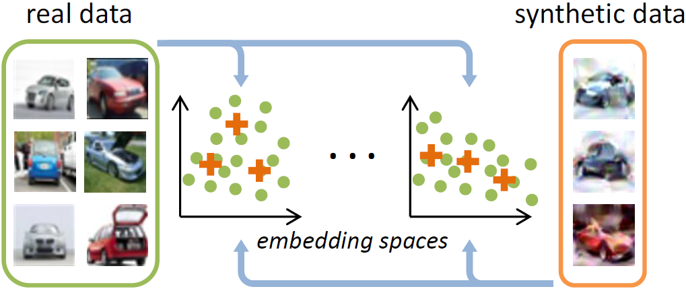
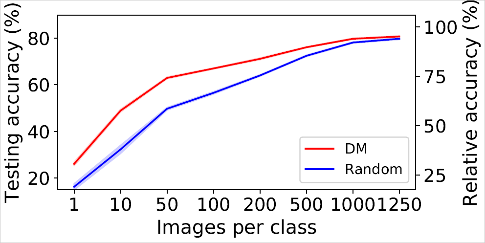

## Dataset Condensation with Distribution Matching [[PDF]](https://arxiv.org/pdf/2110.04181.pdf)
### Method
<p align="center"></p>
<center>Figure 7: Dataset Condensation with Distribution Matching. We
randomly sample real and synthetic data, and then embed them
with the randomly sampled deep neural networks. We learn the
synthetic data by minimizing the distribution discrepancy between
real and synthetic data in these sampled embedding spaces. </center><br>


### Setup
install packages in the requirements. <br>

### TinyImageNet
TinyImageNet dataset [download](https://drive.google.com/file/d/13xbXPCi1LAXuZRNIy6ArkJp79qpwQiIi/view?usp=sharing). Put it into _data_path_. <br>
Tricks to solve the out of memory (OOM) problem: Use "if 'BN' not in args.model:" (Line 158) branch, as we suggest including samples from multiple classes when measuring the running mean/std for BatchNorm. Put image optimization (Line 198-201) into the class loop (Line 158), then you can optimize each class independently. We jointly optimize when memory is enough, as empirically we find it is faster.

### Basic experiments
```
python main_DM.py  --dataset CIFAR10  --model ConvNet  --ipc 10  --dsa_strategy color_crop_cutout_flip_scale_rotate  --init real  --lr_img 1  --num_exp 5  --num_eval 5 
# Empirically, for CIFAR10 dataset we set --lr_img 1 for --ipc = 1/10/50, --lr_img 10 for --ipc = 100/200/500/1000/1250. For CIFAR100 dataset, we set --lr_img 1 for --ipc = 1/10/50/100/125.
```

<p align="center"></p>
<center>Figure 8: Learning large-scale synthetic sets on CIFAR10. </center><br>

DM achieves 67.0 ± 0.3%, 71.2 ± 0.4%, 76.1±0.3%, 79.8±0.3% and 80.8±0.3% testing accuracies with ConvNets when learning 100, 200, 500, 1000 and 1250 images/class synthetic sets on CIFAR10 dataset respectively, which means we can recover 79%, 84%, 90%, 94% and 95% relative performance using only 2%, 4%, 10%, 20% and 25% training data compared to whole dataset training. The performances will be further improved if BatchNorm is used, i.e. ConvNetBN.

<!--
### Large-set Learning Performance
|          | 1 | 10 | 50 | 100 | 200 | 500 | 1000 | 1250 |
 :-: | :-: | :-: | :-: | :-: | :-: | :-: | :-: | :-:
| CIFAR10  |   |   |    | 67.0 ± 0.3 |  |
| CIFAR100 |  |  |  |  |  |

Table 3: Testing accuracies (%) of ConvNets trained from scratch on 1, 10, 50, ... synthetic image(s)/class. 
-->

###  Cross-architecture experiments
```
python main.py  --dataset CIFAR10  --model ConvNetBN  --ipc 50  --init real  --method DSA  --dsa_strategy color_crop_cutout_flip_scale_rotate  --lr_img 0.1  --eval_mode B  --num_exp 5  --num_eval 5
python main_DM.py  --dataset CIFAR10  --model ConvNetBN  --ipc 50  --init real  --dsa_strategy color_crop_cutout_flip_scale_rotate  --lr_img 1  --eval_mode B  --num_exp 5  --num_eval 5 
# For DM cross-architecture experiments, we use models with batchnorm layer. --model can be ConvNetBN, AlexNetBN, VGG11BN, ResNet18BN_AP/ResNet18BN, ConvNetASwishBN.
```
We introduce **Swish** activation function which may achieve better performance, especially for DC/DSA methods.


###  Continual learning experiments
We do 5 experiments with 5 seeds to generate the class order for both 5 and 10 step learning:
```
for seed_cl in range(5):
    np.random.seed(seed_cl)
    class_order = np.random.permutation(num_classes).tolist()
```
Please download the synthetic sets from [Google Drive](https://drive.google.com/drive/folders/1NEnf_85Hpa2fhztWIxsiDQC1C2w_1YQA?usp=sharing) which are learned in the continual learning scenario and put them into the data path (refer to the code). Then run CL_DM.py using the following scripts:
```
python CL_DM.py  --dataset CIFAR100  --model ConvNet  --steps 5 --method random 
python CL_DM.py  --dataset CIFAR100  --model ConvNet  --steps 5 --method herding 
python CL_DM.py  --dataset CIFAR100  --model ConvNet  --steps 5 --method DSA 
python CL_DM.py  --dataset CIFAR100  --model ConvNet  --steps 5 --method DM 

python CL_DM.py  --dataset CIFAR100  --model ConvNet  --steps 10 --method random 
python CL_DM.py  --dataset CIFAR100  --model ConvNet  --steps 10 --method herding 
python CL_DM.py  --dataset CIFAR100  --model ConvNet  --steps 10 --method DSA 
python CL_DM.py  --dataset CIFAR100  --model ConvNet  --steps 10 --method DM 
```


### Citation
```
@article{zhao2023DM,
  title={Dataset Condensation with Distribution Matching},
  author={Zhao, Bo and Bilen, Hakan},
  booktitle={Proceedings of the IEEE/CVF Winter Conference on Applications of Computer Vision},
  year={2023}
}
```

## Synthesizing Informative Training Samples with GAN [[PDF]](https://arxiv.org/pdf/2204.07513.pdf)
We propose to learn the latent vectors of generators that produces informative training images. Then, we store the generator and learned latent vectors instead of synthetic images, which needs less storage. The code and data have been released in [VICO-UoE/IT-GAN](https://github.com/VICO-UoE/IT-GAN).

### Citation
```
@article{zhao2022synthesizing,
  title={Synthesizing Informative Training Samples with GAN},
  author={Zhao, Bo and Bilen, Hakan},
  journal={NeurIPS 2022 Workshop on Synthetic Data for Empowering ML Research},
  year={2022}
}
```

